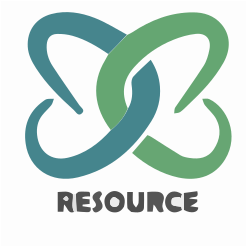

# ReSource – Smart & Sustainable Returns



ReSource is a tech-driven platform that transforms online product returns into social and environmental impact, reducing logistics costs and boosting customer engagement.

---

## 🌍 Live Demo
🚧 *Coming Soon – will be hosted on GitHub Pages / Vercel*

---

## 📦 Project Structure

```
📁 ReSource/
├── index.html
├── styles/
│   └── main.css
├── images/
│   ├── logoSVG.svg
│   ├── clothesOnhangers.png
│   ├── packedClothes.png
│   └── icons/
│       └── linkedin-logo.png
└── README.md
```

---

## ✨ Features

- ✅ Fully responsive design (mobile-first)
- 🎯 Semantic HTML5 and accessibility-conscious
- ⚡ Smooth scroll & subtle animations
- 💡 Organized with clean Flexbox layouts
- 🌱 Optimized for sustainability messaging

---

## 🛠️ Getting Started

To run locally:

```bash
git clone https://github.com/your-username/resource-landing-page.git
cd resource-landing-page
open index.html
```

---

## 👨‍💼 Team

- **Yahalom B.R Shamay** – CEO  
  [Yahalom@ReSource-life.com](mailto:Yahalom@ReSource-life.com)

- **Ori Baumgarten** – COO  
  [Ori@ReSource-life.com](mailto:Ori@ReSource-life.com)

[](https://www.linkedin.com/company/resource-life)

---

## 📜 License

© 2025 ReSource. All rights reserved.
